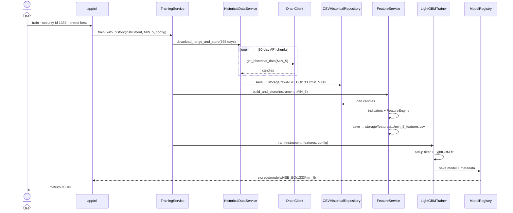
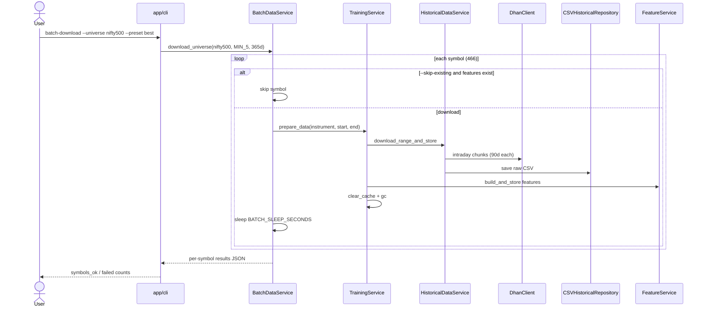
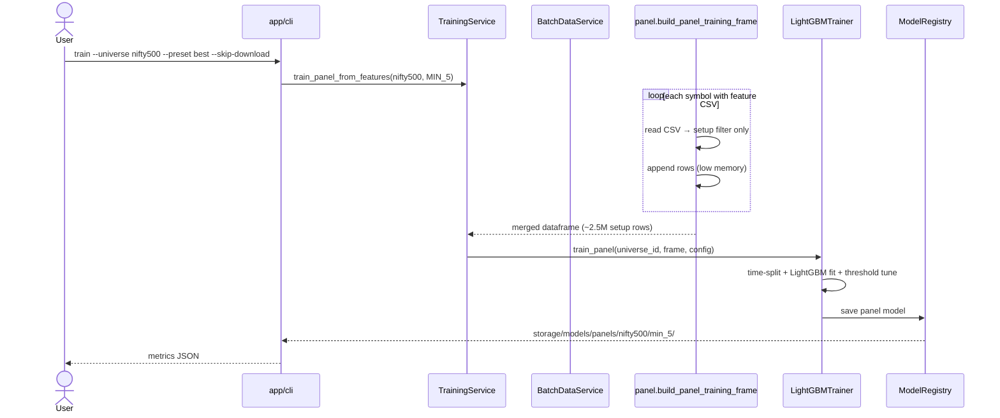
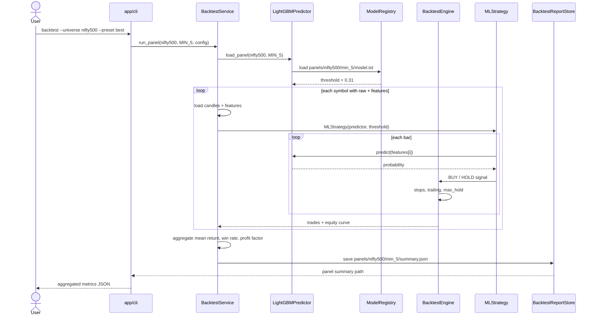
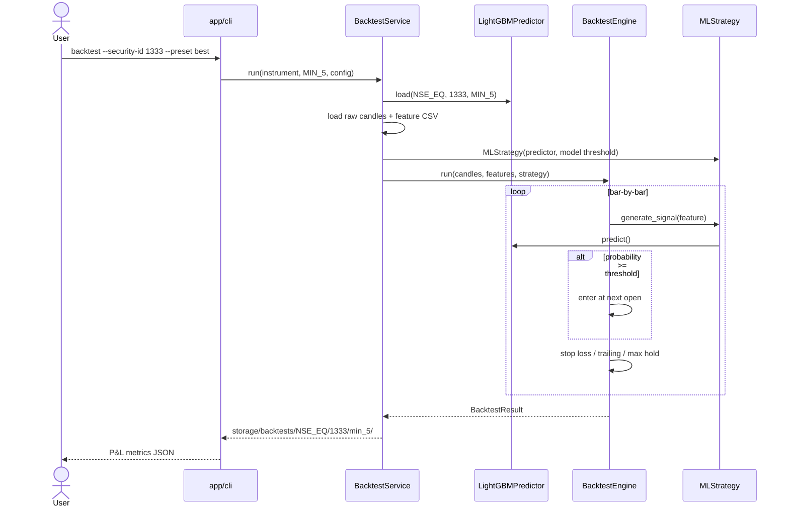

# Architecture

## Layers

| Layer | Package | Responsibility |
|---|---|---|
| API | `app/api/v1/` | HTTP endpoints, versioned |
| CLI | `app/cli/` | Batch jobs without HTTP |
| Services | `app/services/` | Orchestration |
| Domain | `app/domain/` | Entities, value objects, enums |
| Data | `app/data/` | Providers, repositories, universes |
| Brokers | `app/brokers/` | External broker integrations |
| Core | `app/core/` | Config, logging, events |
| Cache | `app/cache/` | In-memory (Phase 1), Redis later |
| Strategy | `app/strategy/` | Trading strategies and presets |
| Risk | `app/risk/` | Position sizing, stops, exposure |
| ML | `app/ml/` | Full ML lifecycle |
| Indicators | `app/indicators/` | Technical indicators (Phase 2) |

## Sequence diagrams

### Single-stock training



### Batch download (Nifty 500)



### Panel training (Nifty 500)



### Panel backtest (Nifty 500)



### Single-stock backtest



## Data flow

### Single instrument

```text
Dhan API → DhanClient → HistoricalDataProvider → HistoricalDataService
                                                         ↓
                                              CSVHistoricalRepository
                                                         ↓
                                              storage/raw/{segment}/{id}/
                                                         ↓
FeatureDatasetBuilder → FeatureEngine → CSVFeatureRepository
                                                         ↓
                                              storage/features/...
                                                         ↓
LightGBMTrainer → ModelRegistry → storage/models/{segment}/{id}/
```

### Panel (multi-stock)

```text
Universe (nifty50 / nifty500)
       ↓
BatchDataService ──loop──► prepare_data() per symbol (with sleep between symbols)
       ↓
load_panel_features() ──concat──► LightGBMTrainer.train_panel()
       ↓
storage/models/panels/{universe_id}/{timeframe}/
```

## Key components

| Component | Path | Role |
|---|---|---|
| Universe registry | `app/data/universe/registry.py` | Load Nifty 50/500 instrument lists |
| Batch download | `app/services/batch_data_service.py` | Loop download + features with rate pause |
| Panel loader | `app/ml/datasets/panel.py` | Merge feature CSVs across symbols |
| Intraday chunking | `app/data/providers/historical_data_provider.py` | 90-day API chunks |
| Best preset | `app/strategy/presets.py` | Validated 5-min train/backtest config |
| Model registry | `app/ml/registry/model_registry.py` | Per-stock and panel model paths |

## Event pipeline (future)

```text
Raw OHLCV → Indicators → Features → ML Train → Inference → Strategy → Risk → Execution
```

Events are published via `app/core/events.py` (`NEW_CANDLE`, `FEATURES_READY`, etc.).

## Storage layout

```text
storage/
  raw/         OHLCV from brokers
  processed/   Indicator snapshots
  features/    Engineered feature CSVs
  models/
    NSE_EQ/{security_id}/{timeframe}/   # per-stock models
    panels/{universe_id}/{timeframe}/   # panel models
  backtests/   Backtest results
  logs/        Long-running job logs (optional)
```

## Repository pattern

Swap storage without changing business logic:

- `HistoricalRepository` (protocol) → `CSVHistoricalRepository`
- `FeatureRepository` (protocol) → `CSVFeatureRepository`
- Future: Parquet, Postgres

## Configuration

Environment variables (see `.env.example`):

| Variable | Default | Purpose |
|---|---|---|
| `DHAN_CLIENT_ID` | — | Dhan API client ID |
| `DHAN_ACCESS_TOKEN` | — | Dhan access token |
| `STORAGE_PATH` | `storage` | Local data directory |
| `BATCH_SLEEP_SECONDS` | `3` | Pause between symbols in batch runs |
| `CACHE_TTL_SECONDS` | `300` | In-memory cache TTL |

## Documentation

- [CLI Reference](CLI.md)
- [ML Training](ML_TRAINING.md)
- [Stock Universes](UNIVERSES.md)
