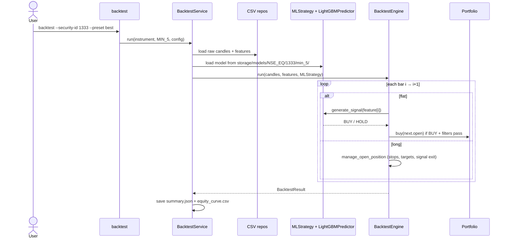
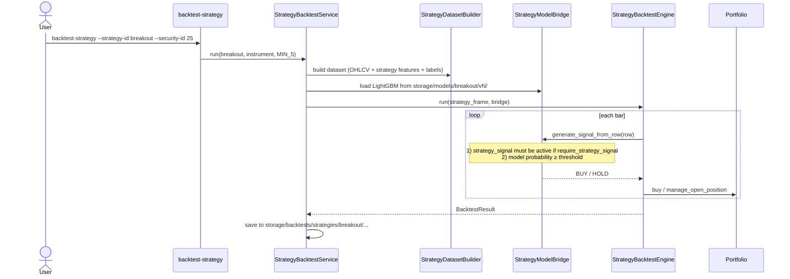
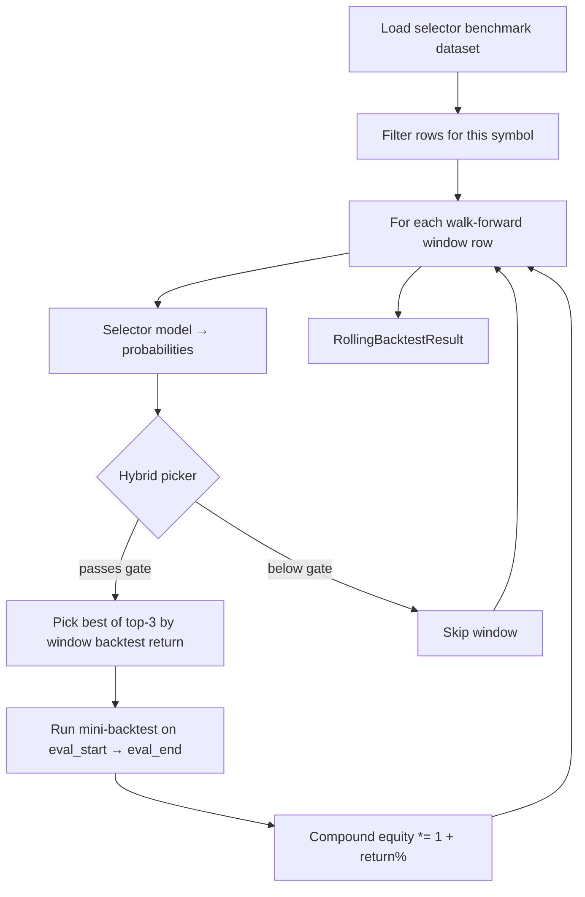
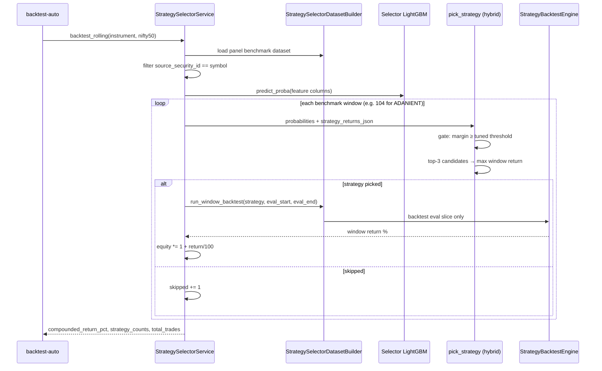
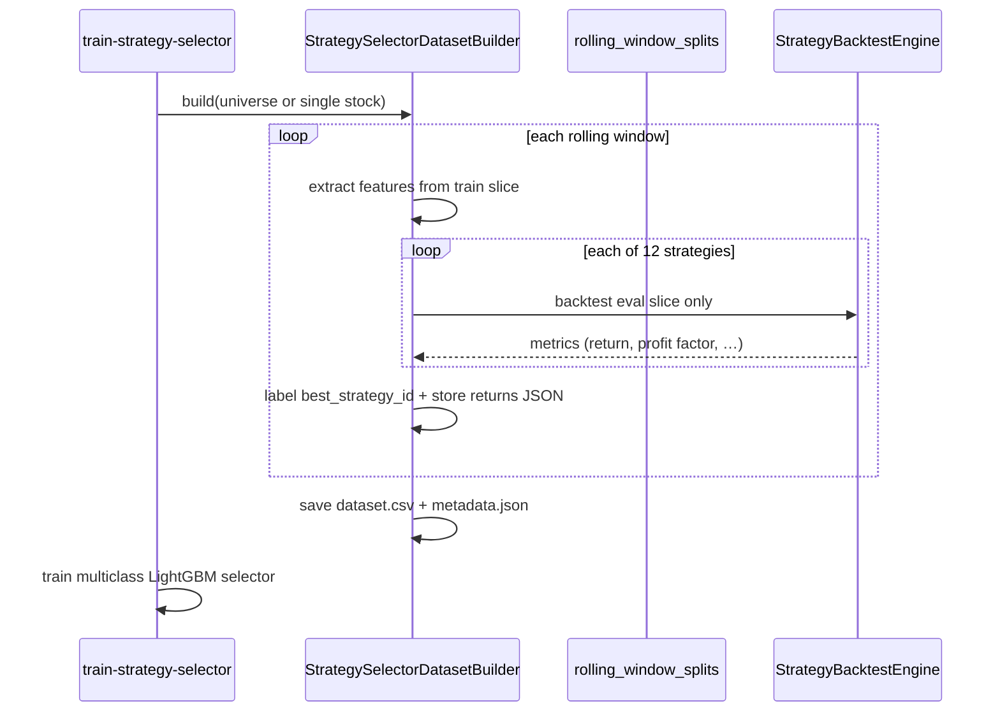
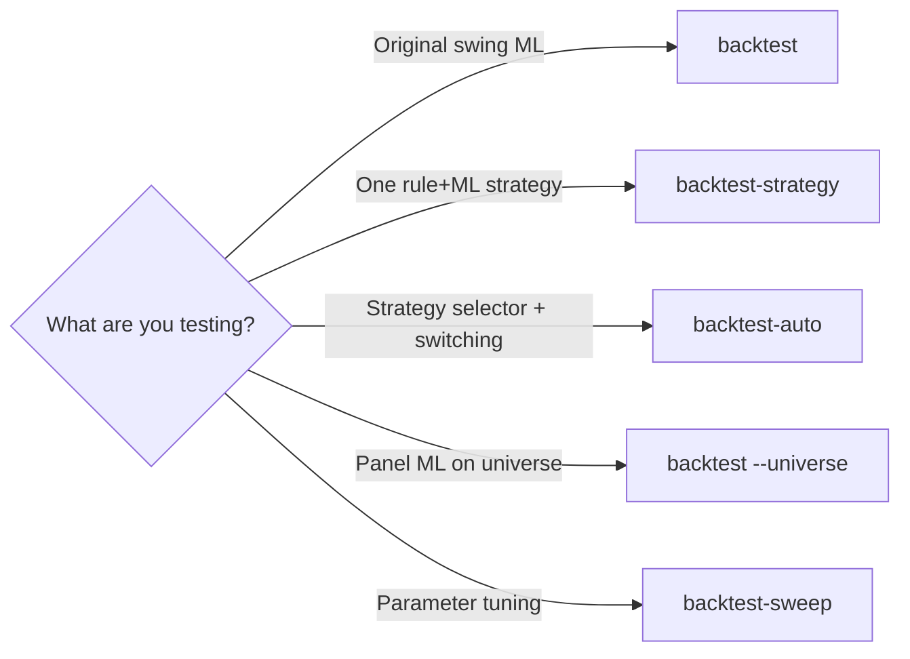

# Backtesting Guide

How simulated trading works in TradeQuant: bar-by-bar execution, walk-forward windows, strategy selection, and the different CLI backtest modes.

## Overview

All backtests are **long-only, cash-equity simulations** on stored historical data. No broker orders are placed.

```text
Historical OHLCV + features
        ↓
Signal (ML model or rule + LightGBM)
        ↓
Bar-by-bar loop (BacktestEngine / StrategyBacktestEngine)
        ↓
Portfolio (entries, stops, targets, exits)
        ↓
BacktestResult (trades, equity curve, metrics)
```

| CLI command | Engine | Signal source | Typical use |
|---|---|---|---|
| `backtest` | `BacktestEngine` | Per-stock or panel **swing ML** model | Original ML path |
| `backtest-strategy` | `StrategyBacktestEngine` | One **Phase 3 strategy** model | Test a single strategy |
| `backtest-auto` | Rolling meta + `StrategyBacktestEngine` | **Strategy selector** picks strategy per window | Main workflow (ADANIENT +21%) |
| `backtest-sweep` | `BacktestEngine` | Grid-search parameters | Tune ML swing config |
| `backtest` `--universe` | `BacktestEngine` × N | **Panel ML** model on each symbol | Universe-wide swing backtest |

Paper trading reuses the same execution rules via `PaperInstrumentEngine` — see [LIVE_TRADING.md](LIVE_TRADING.md) and [PAPER_TRADING.md](PAPER_TRADING.md).

---

## Shared simulation core

Every bar-by-bar backtest uses the same three components.

### 1. `Portfolio` (`app/backtest/portfolio.py`)

Long-only cash account:

- **Entry:** `buy(price, timestamp)` — uses `position_size_pct` of cash (default 95%), applies commission
- **Exit:** `sell` / `sell_partial` — records `BacktestTrade` with PnL and `exit_reason`
- **Stops:** fixed % stop, trailing stop (after activation), breakeven after T1
- **Scaled targets:** T1 / T2 / T3 partial exits when `use_scaled_targets=True`

### 2. `manage_open_position` (`app/backtest/position_manager.py`)

Called on each bar while holding a position, in order:

```text
1. portfolio.on_bar()           — increment bars_held, update peak price
2. process_profit_targets()     — T1 (+0.5%), T2 (+1.0%), T3 (+1.5%) partial sells
3. check_stop_hit()             — intrabar stop (stop_loss)
4. should_time_exit()           — max_hold_bars exceeded → exit at next open
5. on_signal_check()            — N consecutive non-BUY bars → signal exit at next open
```

### 3. `TradeFilterState` (`app/backtest/trade_filters.py`)

Entry gates while flat:

| Filter | Config field | Best preset |
|---|---|---|
| Min bars between entries | `min_bars_between_entries` | 5 |
| Max trades per day | `max_trades_per_day` | 3 |
| Cooldown after stop | `cooldown_bars_after_stop` | 10 |
| Exit confirmation | `exit_confirmation_bars` | 2 |

### Best preset (`BEST_5M_BACKTEST`)

From `app/strategy/presets.py` — used by `backtest-strategy`, `backtest-auto`, and paper trading:

| Setting | Value |
|---|---|
| Stop loss | 0.5% |
| T1 / T2 / T3 | +0.5% / +1.0% / +1.5% (33% / 33% / remainder) |
| Risk : reward | 1 : 3 |
| Max hold | 20 bars |
| Trailing stop | 0.4% after 1.2% gain |
| Move stop to breakeven | After T1 |
| Require strategy signal | Yes (rule + model must agree) |

### Bar loop convention

Both engines iterate `for index in range(len - 1)`:

- **Signals** are evaluated on bar `current` (index `i`)
- **Fills** happen at bar `next` open (index `i+1`) — avoids look-ahead bias
- **Equity** is marked at `next.close`

---

## Mode 1: ML swing backtest (`backtest`)

**Path:** `BacktestService` → `BacktestEngine` + `MLStrategy`



**Signal:** `MLStrategy` runs LightGBM on feature vector; BUY if probability ≥ threshold.

**Optional filters:** `probability_threshold`, `min_expected_value`, `require_strategy_signal`.

**Output:** `storage/backtests/NSE_EQ/{id}/min_5/`

---

## Mode 2: Single strategy backtest (`backtest-strategy`)

**Path:** `StrategyBacktestService` → `StrategyBacktestEngine` + `StrategyModelBridge`



**Two-layer signal:**

1. **Rule signal** — underlying strategy (e.g. breakout pattern) from `strategy_signal` column
2. **ML filter** — per-strategy LightGBM confirms entry (`StrategyModelBridge`)

With `--preset best`, both must agree (`require_strategy_signal=True`).

---

## Mode 3: Rolling auto-backtest (`backtest-auto`) — recommended

**Path:** `StrategySelectorService.backtest_rolling()` — does **not** run one continuous backtest. It compounds returns across **walk-forward windows**, switching strategy each window.

### High-level flow



### Sequence diagram



### Walk-forward windows

Built during `train-strategy-selector` (`StrategySelectorDatasetBuilder`):

| Parameter | Default | Meaning |
|---|---|---|
| `train_window` | 400 bars | Feature context (not traded) |
| `step_size` | 50 bars | Roll forward by this many bars |
| `eval slice` | next 50 bars | Each strategy backtested here |
| `objective` | profit_factor | Labels `best_strategy_id` per window |
| `min_trades` | 2 | Ignore strategies with fewer trades in window |

Each benchmark row stores:

- Market + regime **features** at window anchor
- `eval_start`, `eval_end` — the out-of-sample slice
- `strategy_returns_json` — per-strategy return % in that window
- `best_strategy_id` — training label for selector model

### Hybrid picker (`app/ml/selector/picker.py`)

For each window:

1. **Gate** — top probability must exceed tuned **margin** (top − second), not absolute 35% (12-class problem)
2. **Shortlist** — model top-3 strategies by probability
3. **Pick** — choose shortlist member with **best `strategy_returns_json` score** in that window

This prevents blindly following a model favorite when another strategy scored better in the mini-backtest.

### Compounding

```python
equity *= 1 + window_return_pct / 100
compounded_return = (equity / initial_capital - 1) * 100
```

Example (ADANIENT, single-stock selector): **+21.54%** over 104 windows, 53 traded, 61 total trades.

With pooled Nifty 50 selector (`--universe nifty50`): same logic, benchmark rows filtered by `source_security_id`.

---

## Mode 4: Selector benchmark build (training data)

This is not a user-facing backtest command, but it **is** the source of walk-forward windows used by `backtest-auto`.



**Output:**

| Scope | Path |
|---|---|
| Single stock | `storage/datasets/strategy_selector/NSE_EQ/{id}/min_5/` |
| Pooled universe | `storage/datasets/strategy_selector/panels/nifty50/min_5/` |

---

## Mode 5: Panel ML backtest (`backtest --universe`)

Uses one **panel LightGBM** trained across all symbols; runs `BacktestEngine` independently on each stock.

```bash
PYTHONPATH=. python3 -m app.cli backtest --universe nifty50 --preset best
```

**Output:** `storage/backtests/panels/nifty50/min_5/summary.json`

Different from `backtest-auto`: no strategy switching, no Phase 3 strategies — swing ML only.

---

## Metrics and reports

Computed in `app/backtest/metrics.py` after the bar loop:

| Metric | Description |
|---|---|
| `total_return_pct` | Sum of trade returns (or equity-based for continuous runs) |
| `profit_factor` | Gross wins / gross losses |
| `sharpe_ratio` | Annualized from equity curve |
| `max_drawdown_pct` | Peak-to-trough on equity curve |
| `win_rate` | Winning trades / total trades |
| `total_trades` | Closed trade legs (partials count separately) |

**Saved artifacts** (`BacktestReportStore`):

```text
storage/backtests/
  NSE_EQ/{id}/min_5/                    # ML swing backtest
    summary.json
    equity_curve.csv
  strategies/{strategy_id}/NSE_EQ/{id}/min_5/   # Phase 3 strategy
  panels/{universe}/min_5/summary.json  # Panel aggregate
  auto/nifty50/{id}_{symbol}.json       # Batch backtest-auto JSON (script output)
```

---

## CLI quick reference

```bash
# ML swing — single stock
PYTHONPATH=. python3 -m app.cli backtest --security-id 1333 --preset best

# One Phase 3 strategy
PYTHONPATH=. python3 -m app.cli backtest-strategy \
  --strategy-id breakout --security-id 25 --timeframe MIN_5 --preset best

# Rolling selector backtest (main workflow)
PYTHONPATH=. python3 -m app.cli backtest-auto \
  --security-id 25 --timeframe MIN_5 --preset best

# Pooled Nifty 50 selector
PYTHONPATH=. python3 -m app.cli backtest-auto \
  --security-id 25 --universe nifty50 --timeframe MIN_5 --preset best

# Batch all Nifty 50
./scripts/run_nifty50.sh backtest --force

# Panel swing ML across universe
PYTHONPATH=. python3 -m app.cli backtest --universe nifty50 --preset best
```

### Prerequisites for `backtest-auto`

1. Raw + feature data downloaded (`batch-download`)
2. Per-strategy models trained (happens during `train-strategy-selector`)
3. Selector benchmark dataset + model trained:

   ```bash
   ./scripts/run_nifty50.sh train --rebuild-dataset
   ```

---

## Decision guide: which backtest to run?



| Question | Command |
|---|---|
| Did breakout alone work on ADANIENT? | `backtest-strategy --strategy-id breakout` |
| Does the selector beat single strategies? | `backtest-auto` vs `backtest-strategy` |
| Full Nifty 50 selector performance? | `./scripts/run_nifty50.sh backtest` |
| Live forward test Monday? | `./scripts/run_paper_nifty50.sh run` |

---

## Key source files

| File | Role |
|---|---|
| `app/backtest/engine.py` | ML swing bar loop |
| `app/backtest/strategy_engine.py` | Phase 3 strategy bar loop |
| `app/backtest/portfolio.py` | Simulated positions, stops, targets |
| `app/backtest/position_manager.py` | Exit priority chain |
| `app/backtest/trade_filters.py` | Entry cooldowns and daily limits |
| `app/backtest/metrics.py` | Sharpe, drawdown, profit factor |
| `app/backtest/report.py` | Persist JSON + CSV |
| `app/services/strategy_selector_service.py` | Rolling `backtest-auto` |
| `app/ml/datasets/strategy_selector_builder.py` | Walk-forward benchmark builder |
| `app/ml/selector/picker.py` | Hybrid strategy picker |
| `app/strategy/presets.py` | `BEST_5M_BACKTEST` config |
| `app/strategy/strategy_model_bridge.py` | Rule + ML signal for Phase 3 |

---

## Related docs

- [Strategy Selector](STRATEGY_SELECTOR.md) — training the meta-model
- [Paper Trading](PAPER_TRADING.md) — live forward test (same execution rules)
- [CLI Reference](CLI.md) — all command flags
- [Architecture](ARCHITECTURE.md) — system layers and other sequence diagrams
- [ML Training](ML_TRAINING.md) — swing ML training path
