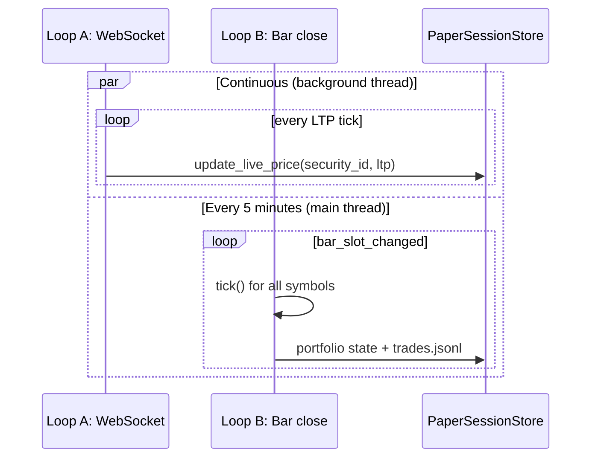
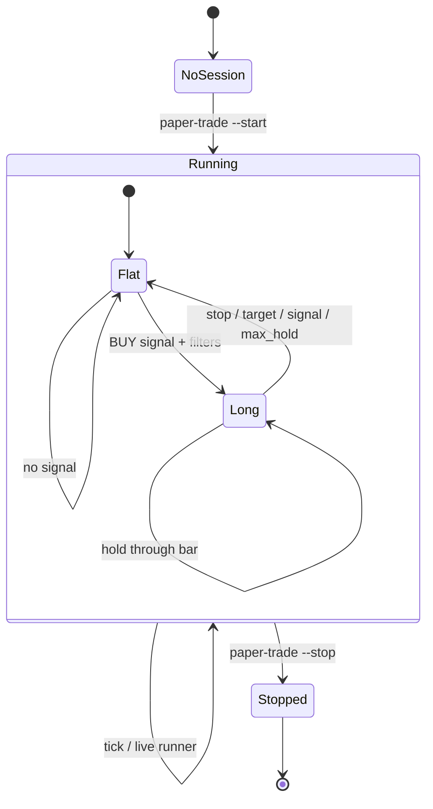
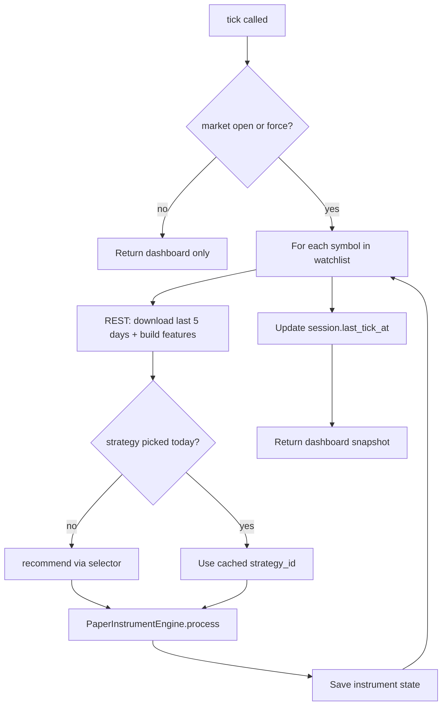
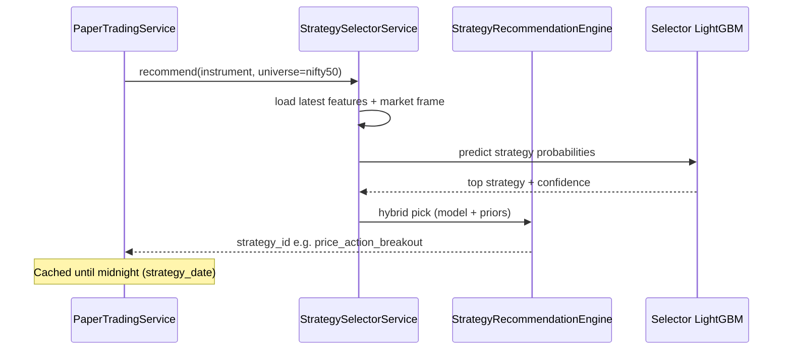
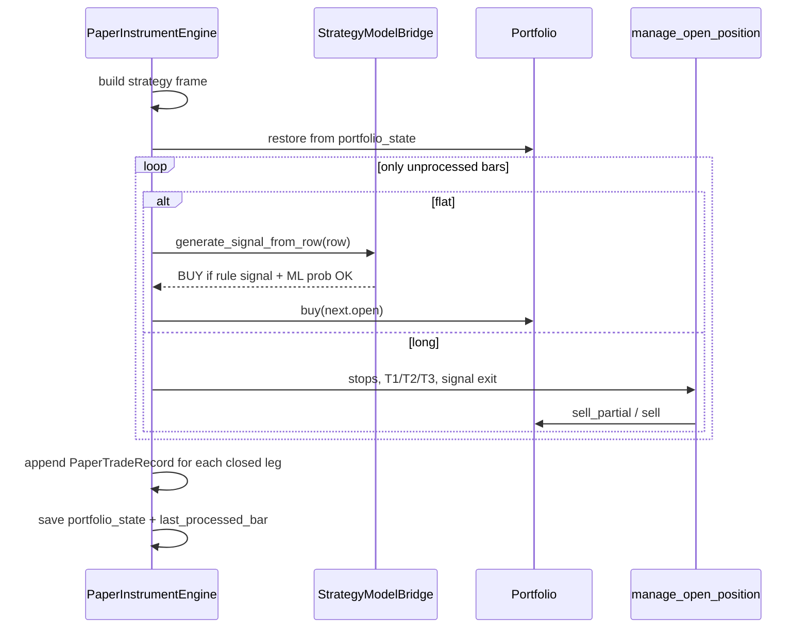
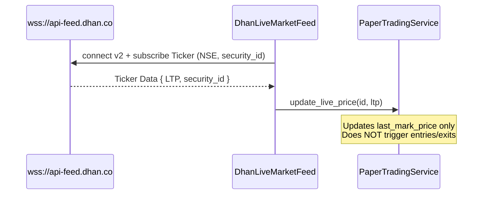
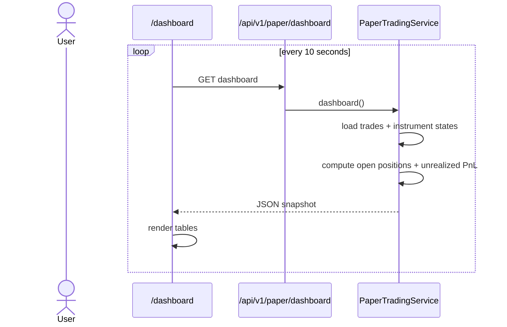
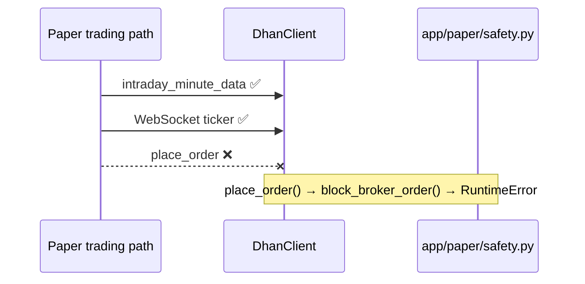
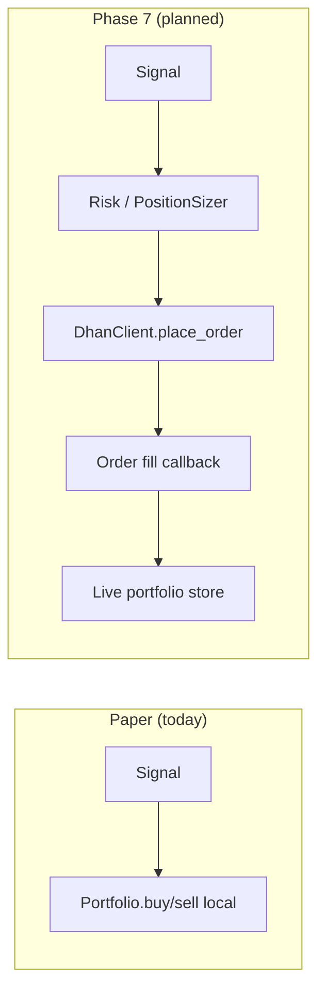

# Live Trading — Logic and Flow

How TradeQuant runs **live forward testing** today (paper mode) and how **real broker execution** (Phase 7) will plug in later.

> **Current status:** Live trading is implemented as **paper trading** — real Dhan market data, simulated fills, no broker orders. See [PAPER_TRADING.md](PAPER_TRADING.md) for quick-start commands.

---

## What “live trading” means in this project

| Mode | Status | Orders | Data | Use |
|---|---|---|---|---|
| **Paper / forward test** | ✅ Implemented | Simulated locally | Dhan WebSocket + REST | Monday validation |
| **Live broker execution** | 🔜 Phase 7 | Real via Dhan API | Same feeds | Production |

Paper mode uses the **same signal and execution rules** as `backtest-auto` / `backtest-strategy` — see [BACKTESTING.md](BACKTESTING.md).

---

## System architecture

```text
                    ┌─────────────────────────────────────┐
                    │         Dhan (read-only)            │
                    │  WebSocket LTP  │  REST 5m OHLCV   │
                    └────────┬───────────────┬────────────┘
                             │               │
              mark price     │               │  bar close refresh
                             ▼               ▼
                    ┌──────────────┐  ┌──────────────────────┐
                    │ DhanLive     │  │ PaperTradingService  │
                    │ MarketFeed   │  │ .tick()              │
                    └──────┬───────┘  └──────────┬───────────┘
                           │                     │
                           │            ┌────────┴────────┐
                           │            │ per symbol:     │
                           │            │ 1. refresh data │
                           │            │ 2. pick strategy│
                           │            │ 3. process bars │
                           │            └────────┬────────┘
                           │                     │
                           ▼                     ▼
                    ┌─────────────────────────────────────┐
                    │      PaperInstrumentEngine          │
                    │  Portfolio + manage_open_position   │
                    │  (same as StrategyBacktestEngine)   │
                    └─────────────────┬───────────────────┘
                                      │
                                      ▼
                    ┌─────────────────────────────────────┐
                    │  PaperSessionStore                  │
                    │  storage/paper/sessions/...         │
                    └─────────────────┬───────────────────┘
                                      │
                                      ▼
                    ┌─────────────────────────────────────┐
                    │  Dashboard  :4000/dashboard         │
                    └─────────────────────────────────────┘
```

---

## Two parallel loops during market hours

Live mode runs **two independent loops** that serve different purposes:

| Loop | Trigger | Purpose | Writes trades? |
|---|---|---|---|
| **A — WebSocket** | Every LTP tick | Update `last_mark_price` for open positions | No |
| **B — Bar close** | New 5m slot (9:20, 9:25, …) | Refresh candles, signals, entries/exits | Yes |



**Why both?** WebSocket gives fast mark-to-market for the dashboard. Strategy logic needs **completed 5m OHLCV bars** + indicators + ML features — only available via REST after bar close.

---

## Trading day timeline (IST)

```text
09:15  Market open
       ├─ WebSocket connects, subscribes Nifty 50 tickers
       └─ First 5m bar closes at 09:20 → tick() runs

09:20  First bar-close tick
       ├─ For each symbol: refresh last 5 days of data
       ├─ recommend-strategy (once per symbol for the day)
       └─ Process any new bars → possible paper entry

09:25  Second bar-close tick
       └─ Process bars since last_processed_bar only

…      Repeat every 5 minutes

15:30  Market close
       ├─ WebSocket may still receive ticks briefly
       └─ Bar-close loop stops processing (unless --force)

Weekend  is_market_open() = false → loops idle, dashboard shows CLOSED
```

Market hours: **NSE 9:15–15:30 IST**, weekdays only (`app/paper/market_hours.py`).

5m bar alignment: slots at `:00`, `:05`, `:10`, … (`app/paper/bar_clock.py`).

---

## Session lifecycle



### Session creation (`start_session`)

1. Load universe (e.g. Nifty 50 = 50 symbols)
2. Split capital: `capital_per_symbol = initial_capital / 50` (default ₹10L → ₹20k/symbol)
3. Create `PaperSession` in `storage/paper/sessions/{session_id}/`
4. Initialize per-symbol state with cash = `capital_per_symbol`

### Persistent state per symbol (`PaperInstrumentState`)

| Field | Purpose |
|---|---|
| `strategy_id` / `strategy_date` | Active strategy for today |
| `last_processed_bar` | Incremental processing cursor |
| `last_mark_price` | WebSocket LTP or last close |
| `portfolio_state` | Serialized `Portfolio` (cash, qty, entry, targets hit) |
| `filter_state` | Serialized `TradeFilterState` (cooldowns, daily count) |
| `realized_pnl` / `trade_count` | Running totals |

State survives restarts — next `tick()` continues from `last_processed_bar`.

---

## Bar-close tick — detailed flow

Each `PaperTradingService.tick()` during market hours:



### Step 1 — Refresh market data

```python
training_service.prepare_data(instrument, MIN_5, start=today-5d, end=today)
```

- Calls Dhan `intraday_minute_data` (**read only**)
- Saves to `storage/raw/.../min_5.csv`
- Rebuilds `storage/features/.../min_5_features.csv`

Live mode uses **5-day lookback** (not 60) for speed. Poll mode uses 60 days.

### Step 2 — Strategy selection (once per symbol per day)

```python
if state.strategy_id and state.strategy_date == today:
    return state.strategy_id  # already picked today

recommendations = selector_service.recommend(instrument, MIN_5, universe_id=nifty50)
strategy_id = recommendations[0].strategy_id
```



**Live vs backtest-auto:** Rolling backtest switches strategy **every walk-forward window** (~50 bars). Live trading picks **one strategy per symbol per trading day** — simpler and stable for forward testing.

### Step 3 — Incremental bar processing (`PaperInstrumentEngine`)

Same bar loop as `StrategyBacktestEngine`, but **only new bars** since `last_processed_bar`:

```text
1. Build full strategy dataset frame (OHLCV + strategy features)
2. Restore Portfolio + TradeFilterState from disk
3. Find start_index = first bar after last_processed_bar
4. For each bar pair (current, next):
     if long  → manage_open_position (targets, stop, max_hold, signal exit)
     if flat  → check filters → BUY at next.open if signal
     last_processed_bar = next.timestamp
5. Persist new closed trades → trades.jsonl
6. Save portfolio + filter state
```



**Signal rules** (with `--preset best`):

1. Underlying **strategy rule** must be active (`strategy_signal > 0`)
2. Per-strategy **LightGBM** probability ≥ model threshold
3. Entry **filters**: max 3 trades/day, 5-bar spacing, 10-bar cooldown after stop

**Exit priority** (while long):

1. T1 (+0.5%) → partial sell 33%
2. T2 (+1.0%) → partial sell 33%
3. T3 (+1.5%) → sell remainder
4. Stop loss (−0.5%)
5. Max hold (20 bars)
6. Signal exit (2 consecutive non-BUY bars)

Fill convention: signal on bar *i*, execution at bar *i+1* **open** — same as backtest (no look-ahead).

---

## WebSocket loop — mark price only



Used by dashboard to show **unrealized PnL** on open positions between bar closes.

---

## Dashboard flow



| UI section | Source |
|---|---|
| Realized PnL | Sum of `trades.jsonl` |
| Open positions | `portfolio_state` where qty > 0 |
| Unrealized PnL | mark_price (WebSocket LTP) vs entry |
| Recent trades | Last 50 closed legs |
| Market badge | `is_market_open()` |

---

## Live vs backtest comparison

| Aspect | `backtest-auto` (historical) | Live paper (`paper-trade --run`) |
|---|---|---|
| Data | Stored CSV | Dhan REST refresh each tick |
| Strategy pick | Every walk-forward window | Once per symbol per day |
| Processing | All windows at once | Incremental from `last_processed_bar` |
| Compounding | Window returns multiplied | Continuous portfolio per symbol |
| Orders | Simulated | Simulated (same `Portfolio`) |
| Output | CLI JSON | `storage/paper/` + dashboard |

Both use `BEST_5M_BACKTEST` execution rules — see [BACKTESTING.md](BACKTESTING.md).

---

## Safety — no broker orders



| Guard | Location |
|---|---|
| `PAPER_TRADING_ONLY = True` | `app/paper/safety.py` |
| `verify_paper_trading_mode()` on service start | `PaperTradingService.__init__` |
| `block_broker_order()` | `DhanClient.place_order()` |
| Local `Portfolio` fills only | `PaperInstrumentEngine` |

---

## How to run

```bash
# Terminal 1 — dashboard
./scripts/run_paper_nifty50.sh serve
# → http://127.0.0.1:4000/dashboard

# Terminal 2 — live runner (WebSocket + bar close)
./scripts/run_paper_nifty50.sh run
```

### Modes

| `--mode` | Behavior |
|---|---|
| `live` (default) | WebSocket LTP + bar-close `tick()` |
| `poll` | REST-only loop every `--poll-seconds` |

### Prerequisites

1. `.env` with `DHAN_CLIENT_ID`, `DHAN_ACCESS_TOKEN`
2. `./scripts/run_nifty50.sh download --skip-existing`
3. `./scripts/run_nifty50.sh train --rebuild-dataset`

---

## Storage layout

```text
storage/paper/
  active_session.json                 → current session id
  sessions/{session_id}/
    session.json                      → capital, universe, last_tick_at
    instruments/{security_id}.json  → portfolio + strategy + cursor
    trades.jsonl                      → append-only closed trades
```

Example trade record:

```json
{
  "symbol": "ADANIENT",
  "strategy_id": "price_action_breakout",
  "entry_time": "2026-07-07T10:05:00",
  "exit_time": "2026-07-07T10:35:00",
  "pnl": 142.50,
  "exit_reason": "target_1"
}
```

---

## Phase 7 — real live trading (planned)

When broker execution is enabled, the same signal path stays; only the **fill layer** changes:



| Component | Today | Phase 7 |
|---|---|---|
| `DhanClient.place_order` | Blocked | Implemented |
| `Portfolio` | In-memory simulation | Synced from broker fills |
| `PositionSizer` | Stub | Wired before order |
| `EventBus` | Partial | `ORDER_PLACED`, `TRADE_EXECUTED` |
| Dashboard | Paper trades | Live orders + positions |

Files prepared for Phase 7: `app/domain/order.py`, `app/domain/trade.py`, `app/risk/position_sizer.py`, `app/brokers/base.py`.

---

## Key source files

| File | Role |
|---|---|
| `app/services/paper_trading_service.py` | Session + tick orchestration |
| `app/paper/live_runner.py` | WebSocket + bar-clock loop |
| `app/paper/engine.py` | Incremental bar processor |
| `app/paper/store.py` | JSON persistence |
| `app/paper/portfolio_state.py` | Portfolio/filter serialization |
| `app/paper/market_hours.py` | NSE session check |
| `app/paper/bar_clock.py` | 5m slot alignment |
| `app/paper/safety.py` | No-broker-order guards |
| `app/brokers/dhan/live_feed.py` | WebSocket wrapper |
| `app/services/strategy_selector_service.py` | Strategy recommendation |
| `app/api/static/dashboard.html` | Live UI |
| `scripts/run_paper_nifty50.sh` | serve / start / run |

---

## Troubleshooting

| Symptom | Cause | Fix |
|---|---|---|
| No trades | Market closed / no signals | Normal on weekends; check Monday 9:20+ |
| Dashboard: no session | Not started | `./scripts/run_paper_nifty50.sh start` |
| Slow tick (50 symbols) | REST refresh per symbol | Use `--security-ids` subset |
| WebSocket disconnect | Token/network | Restart runner; try `--mode poll` |
| Wrong strategy | Selector not trained | `./scripts/run_nifty50.sh train` |
| Duplicate bars processed | Should not happen | `last_processed_bar` prevents re-processing |

---

## Related docs

- [Paper Trading Quick Start](PAPER_TRADING.md) — commands and API reference
- [Backtesting](BACKTESTING.md) — shared execution logic and backtest modes
- [Strategy Selector](STRATEGY_SELECTOR.md) — how strategies are trained and picked
- [CLI Reference](CLI.md) — all flags
- [Architecture](ARCHITECTURE.md) — system layers
