# Nifty 50 Backtest Report

Generated: **2026-07-05 16:35 UTC**

Rolling `backtest-auto` results for all **50 Nifty 50** symbols using the pooled strategy selector 
(`--universe nifty50 --preset best`). Each symbol starts with **₹1,00,000** simulated capital.

## Proof & data sources

| Artifact | Path |
|---|---|
| Raw CLI outputs (50 files) | `storage/backtests/auto/nifty50/` |
| Batch summary log | `storage/backtests/auto/nifty50/summary.jsonl` |
| Selector benchmark dataset | `storage/datasets/strategy_selector/panels/nifty50/min_5/dataset.csv` |
| Selector model | `storage/models/strategy_selector/panels/nifty50/min_5/` |
| Charts in this report | `docs/images/nifty50_backtest/` |

Command used per symbol:

```bash
PYTHONPATH=. python3 -m app.cli backtest-auto \
  --security-id <ID> --universe nifty50 --timeframe MIN_5 --preset best
```

## Panel summary

| Metric | Value |
|---|---|
| Symbols completed | 50 / 50 |
| Average rolling return | **10.90%** |
| Median rolling return | **12.20%** |
| Profitable symbols | 49 / 50 (98%) |
| Total trades (all symbols) | 6,200 |

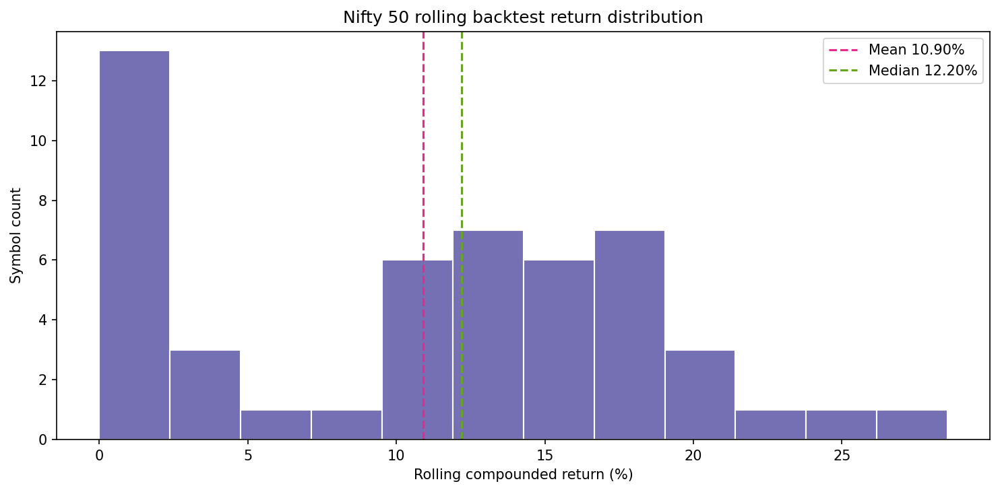

## Top 10 performers

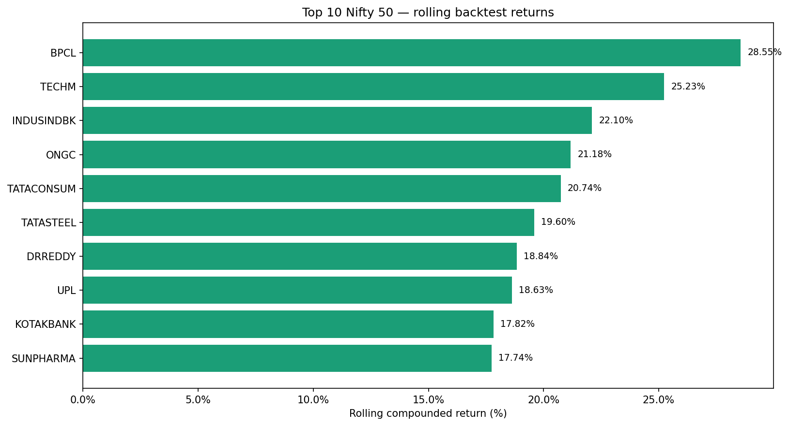

| Rank | Symbol | ID | Return | Trades | Windows traded | ML pick | Confidence | Hit rate | Proof file |
|---:|---|---:|---:|---:|---|---|---|---|---|
| 1 | BPCL | 526 | **+28.55%** | 222 | 131/235 | bollinger_mean_reversion | 15% | 38.2% | `526_BPCL.json` |
| 2 | TECHM | 13538 | **+25.23%** | 173 | 114/222 | price_action_breakout | 19% | 28.1% | `13538_TECHM.json` |
| 3 | INDUSINDBK | 5258 | **+22.10%** | 176 | 105/229 | ema_pullback | 35% | 41.0% | `5258_INDUSINDBK.json` |
| 4 | ONGC | 2475 | **+21.18%** | 218 | 121/215 | ema_pullback | 15% | 38.8% | `2475_ONGC.json` |
| 5 | TATACONSUM | 3432 | **+20.74%** | 195 | 118/216 | breakout | 56% | 39.0% | `3432_TATACONSUM.json` |
| 6 | TATASTEEL | 3499 | **+19.60%** | 167 | 121/244 | breakout | 55% | 24.0% | `3499_TATASTEEL.json` |
| 7 | DRREDDY | 881 | **+18.84%** | 171 | 108/227 | bollinger_mean_reversion | 17% | 31.5% | `881_DRREDDY.json` |
| 8 | UPL | 11287 | **+18.63%** | 175 | 111/223 | breakout | 55% | 30.6% | `11287_UPL.json` |
| 9 | KOTAKBANK | 1922 | **+17.82%** | 199 | 125/214 | ema_pullback | 15% | 34.4% | `1922_KOTAKBANK.json` |
| 10 | SUNPHARMA | 3351 | **+17.74%** | 194 | 120/213 | breakout | 55% | 30.8% | `3351_SUNPHARMA.json` |

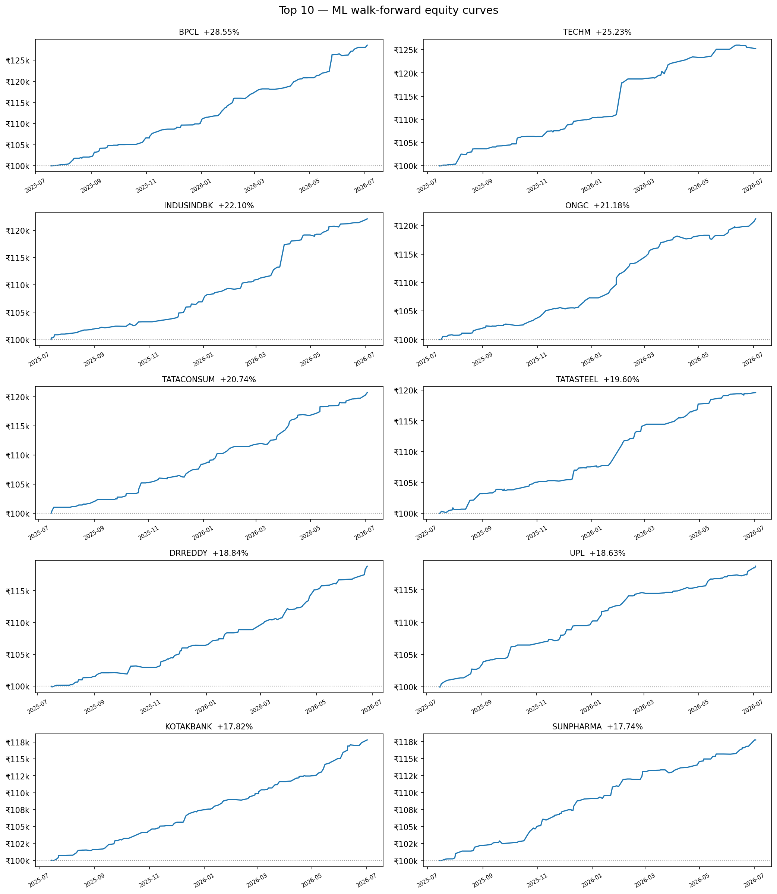

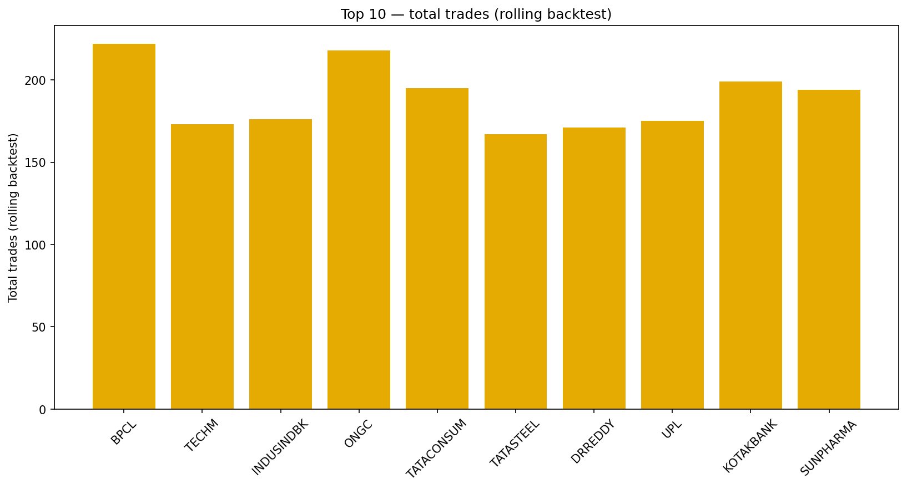

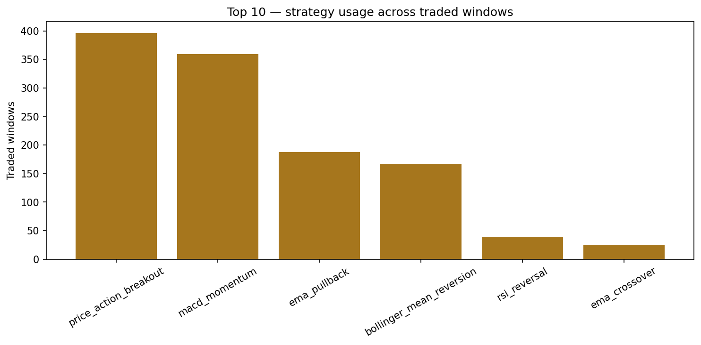

## Bottom 10 performers

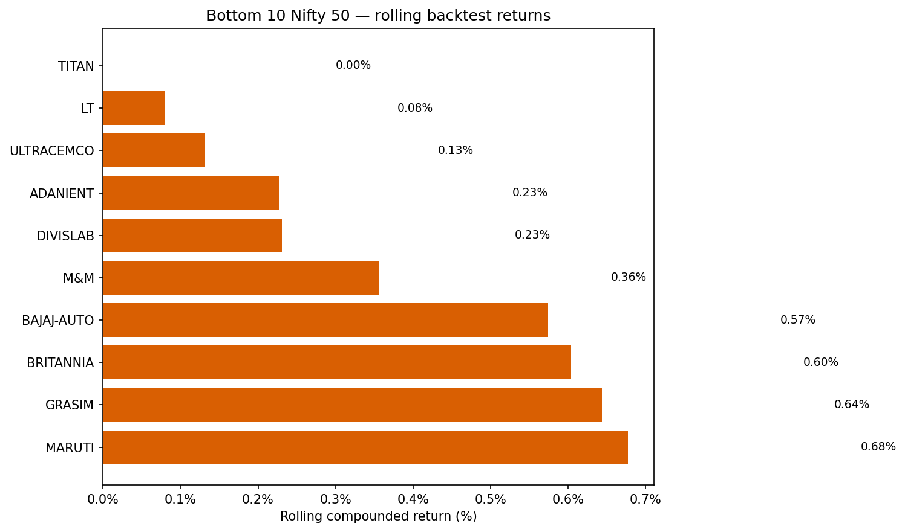

| Rank | Symbol | ID | Return | Trades | Windows traded | ML pick | Confidence | Hit rate | Proof file |
|---:|---|---:|---:|---:|---|---|---|---|---|
| 41 | MARUTI | 10999 | **+0.68%** | 5 | 48/55 | price_action_breakout | 22% | 50.0% | `10999_MARUTI.json` |
| 42 | GRASIM | 1232 | **+0.64%** | 11 | 11/22 | breakout | 56% | 72.7% | `1232_GRASIM.json` |
| 43 | BRITANNIA | 547 | **+0.60%** | 8 | 36/59 | breakout | 56% | 44.4% | `547_BRITANNIA.json` |
| 44 | BAJAJ-AUTO | 16669 | **+0.57%** | 11 | 41/51 | macd_momentum | 18% | 29.3% | `16669_BAJAJ-AUTO.json` |
| 45 | M&M | 2031 | **+0.36%** | 4 | 20/29 | breakout | 55% | 35.0% | `2031_M&M.json` |
| 46 | DIVISLAB | 10940 | **+0.23%** | 9 | 38/56 | breakout | 55% | 39.5% | `10940_DIVISLAB.json` |
| 47 | ADANIENT | 25 | **+0.23%** | 61 | 53/104 | breakout | 56% | 30.2% | `25_ADANIENT.json` |
| 48 | ULTRACEMCO | 11532 | **+0.13%** | 5 | 29/40 | price_action_breakout | 11% | 51.7% | `11532_ULTRACEMCO.json` |
| 49 | LT | 11483 | **+0.08%** | 2 | 16/23 | macd_momentum | 37% | 50.0% | `11483_LT.json` |
| 50 | TITAN | 3506 | **+0.00%** | 0 | 21/27 | breakout | 55% | 47.6% | `3506_TITAN.json` |

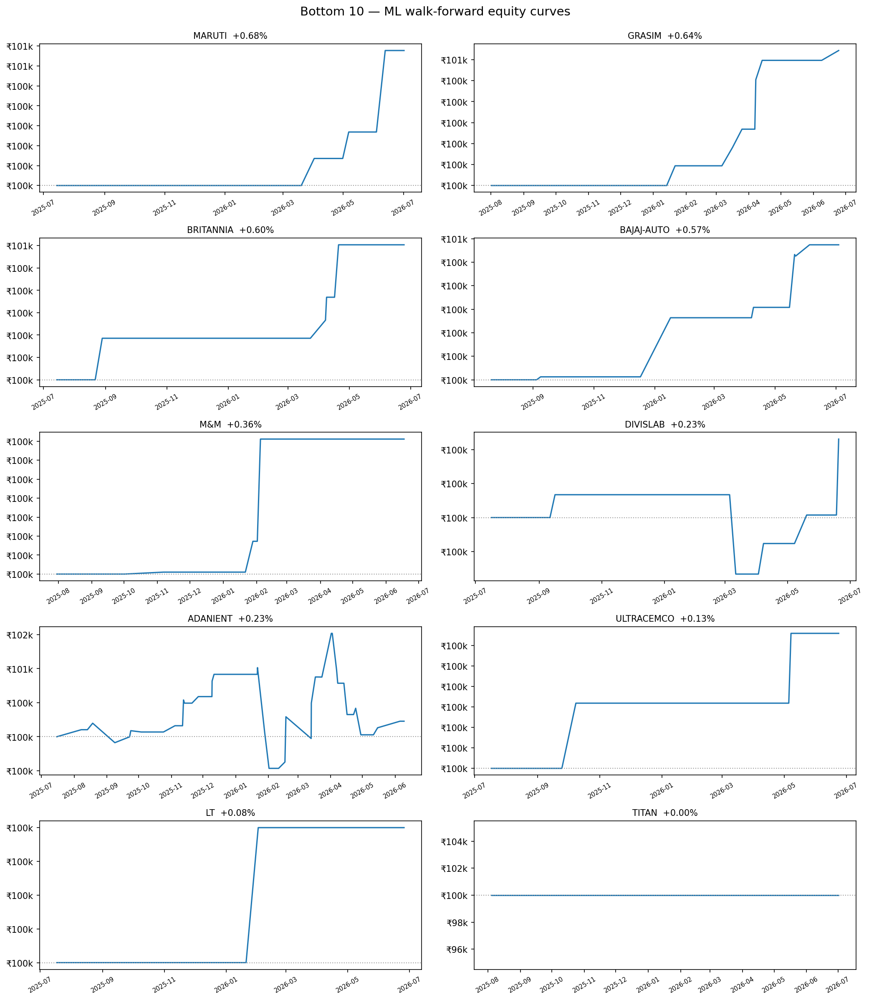

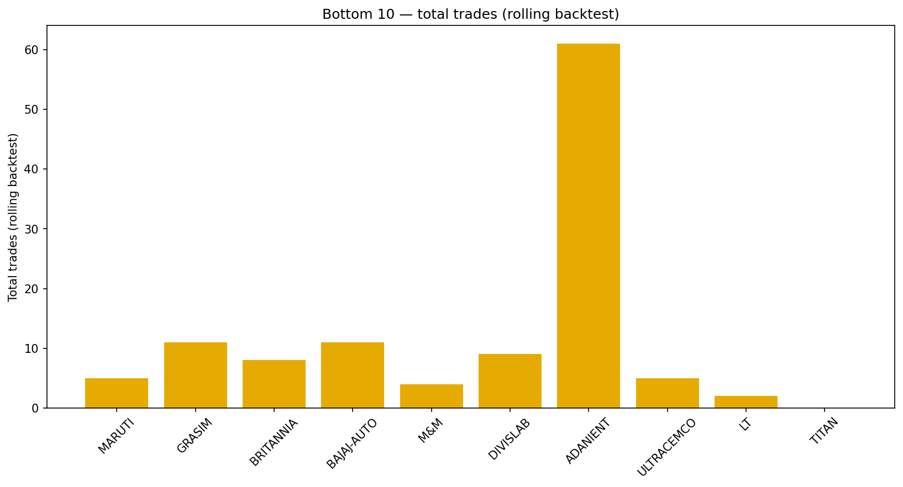

## Detailed ML + walk-forward charts (exemplars)

Equity and per-window return charts rebuilt from the **selector benchmark** 
(ML strategy pick per window × stored window returns). 
Reported compounded return in chart title matches the saved `backtest-auto` JSON.

| Symbol | Tier | Chart | Reported return |
|---|---|---|---:|
| BPCL | Top | [detail](images/nifty50_backtest/detail_bpcl.png) | +28.55% |
| TECHM | Top | [detail](images/nifty50_backtest/detail_techm.png) | +25.23% |
| TITAN | Bottom | [detail](images/nifty50_backtest/detail_titan.png) | +0.00% |
| LT | Bottom | [detail](images/nifty50_backtest/detail_lt.png) | +0.08% |

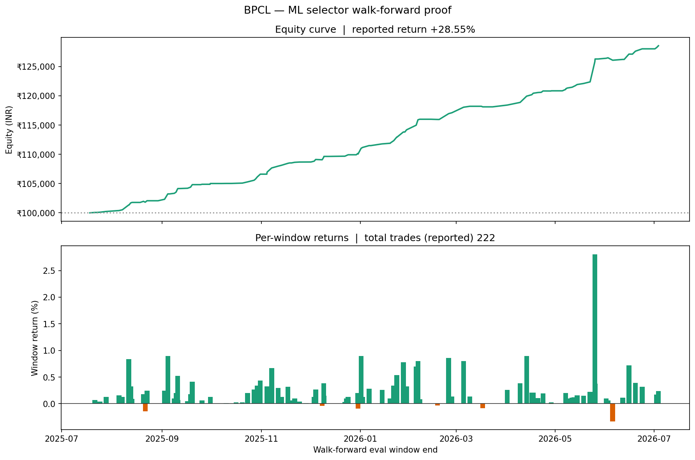

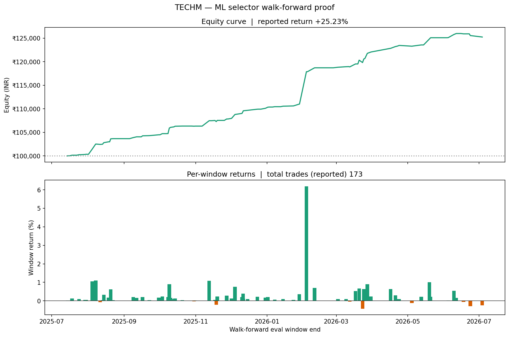

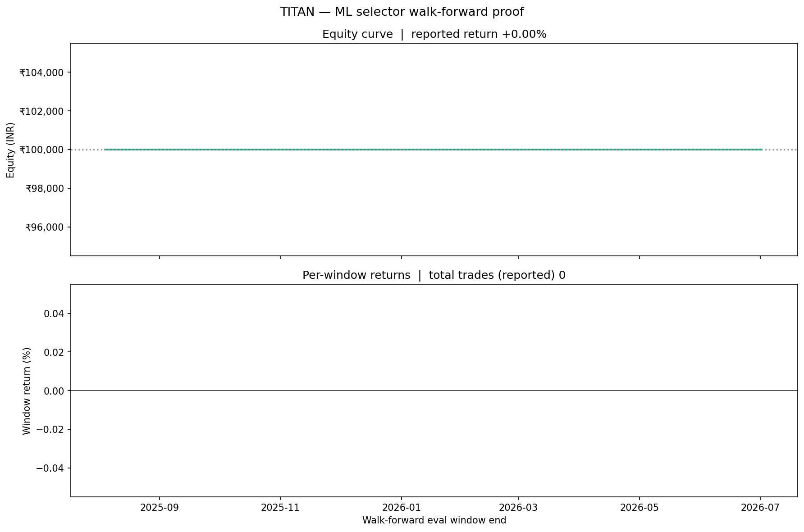

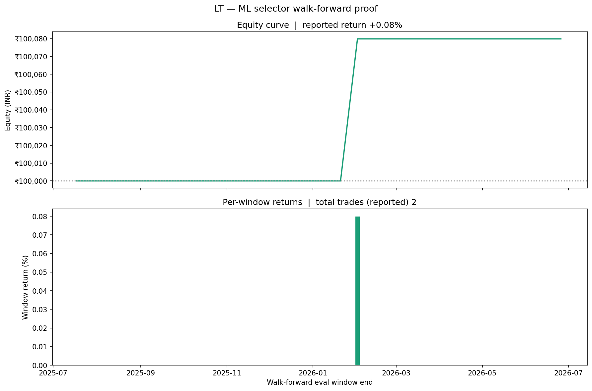

## ML methodology (what the graphs prove)

1. **Walk-forward windows** — 400-bar train slice, 50-bar eval slice (`train_window=400`, `step_size=50`).
2. **Strategy selector (LightGBM)** — picks one of 12 Phase-3 strategies per window using regime + feature columns.
3. **Rolling backtest** — compounds actual mini-backtest PnL per selected window (`StrategyBacktestEngine`).
4. **ML recommendation column** — latest-bar selector output stored in each JSON (`recommendations[0]`).
5. **Hit rate** — meta simulation: selector pick matched best historical strategy for that window.

## How to regenerate

```bash
./scripts/run_nifty50.sh backtest --force   # re-run all 50 (slow)
python3 scripts/generate_nifty50_backtest_report.py
```

See also: [BACKTESTING.md](BACKTESTING.md)
