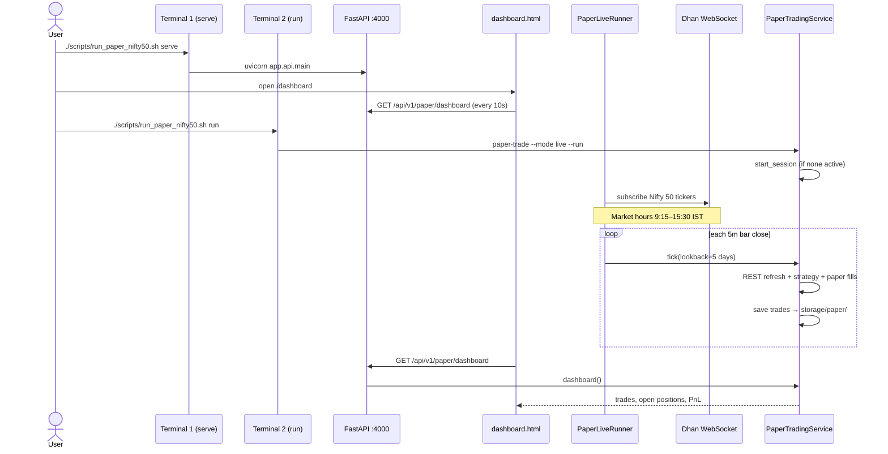
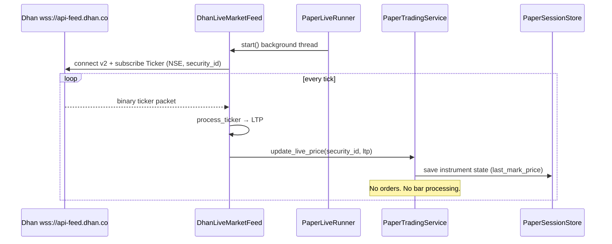
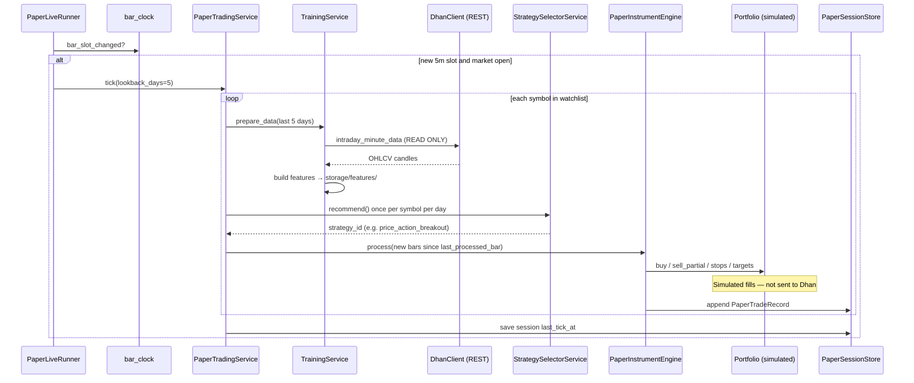
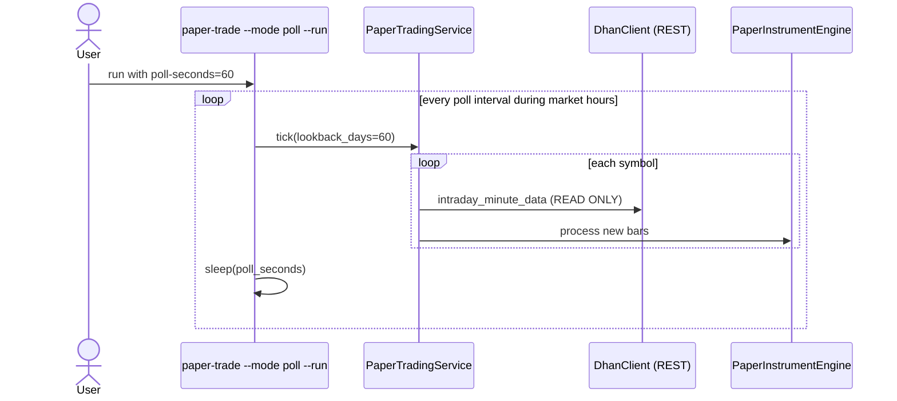
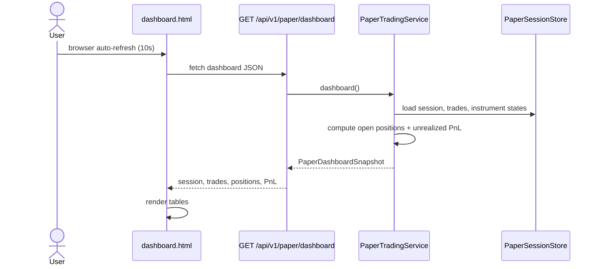
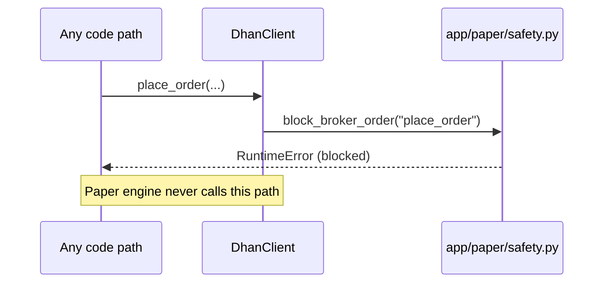

# Paper Trading (Live Forward Testing)

Simulated live trading using the **strategy selector** and **best 5m preset**. Dhan is used for **market data only** — no real orders are placed.

## Overview

```text
Strategy selector (trained on Nifty 50/500)
       ↓
Pick best strategy per symbol per day
       ↓
Live WebSocket LTP  +  REST 5m OHLCV on bar close
       ↓
Paper engine (Portfolio simulation — same rules as backtest-auto)
       ↓
Persist trades → Dashboard (http://127.0.0.1:4000/dashboard)
```

| Mode | Data source | When to use |
|---|---|---|
| **`live` (default)** | Dhan WebSocket (LTP) + REST on 5m bar close | Monday forward testing — recommended |
| **`poll`** | REST intraday API on a timer | Fallback if WebSocket fails |

### Why WebSocket + REST (not poll-only)?

| Need | WebSocket | REST intraday API |
|---|---|---|
| Live mark price on dashboard | ✅ Ticker LTP | ❌ Too slow if polled constantly |
| Full 5m OHLCV bar (open/high/low/close/volume) | ❌ Ticker has price only | ✅ Required |
| Indicators + ML features | ❌ | ✅ Built from stored candles |
| Strategy signals | ❌ | ✅ Per-strategy LightGBM on feature rows |

**WebSocket alone cannot run the strategy** — the engine needs completed 5-minute candles and engineered features. The live runner combines both:

1. **WebSocket** — continuous LTP updates for open-position PnL on the dashboard.
2. **REST (read-only)** — on each 5-minute bar boundary, refresh recent candles, rebuild features, run the paper engine on new bars.

---

## Safety: no trading on Dhan

Paper trading **never** sends orders to the broker.

| Dhan API | Paper trading | Live trading (future Phase 7) |
|---|---|---|
| `intraday_minute_data` (REST) | ✅ Read candles | ✅ |
| `MarketFeed` WebSocket (ticker) | ✅ Read LTP | ✅ |
| `place_order` | ❌ **Blocked** | ✅ |
| `get_positions` | ❌ Not called | ✅ |
| Funds / order update APIs | ❌ Not called | ✅ |

Guards in code:

| File | Guard |
|---|---|
| `app/paper/safety.py` | `PAPER_TRADING_ONLY = True`, `verify_paper_trading_mode()` |
| `app/brokers/dhan/client.py` | `place_order()` calls `block_broker_order()` |
| `app/paper/engine.py` | Uses local `Portfolio` only — simulated fills |
| `app/paper/store.py` | Trades saved to `storage/paper/` only |

On startup you will see:

```text
Paper trading mode: Dhan is used for market DATA only. No orders, positions, or funds APIs are called.
```

---

## Prerequisites

1. Valid `.env`: `DHAN_CLIENT_ID`, `DHAN_ACCESS_TOKEN`
2. Nifty 50 data downloaded:

   ```bash
   ./scripts/run_nifty50.sh download --skip-existing
   ```

3. Strategy selector trained on Nifty 50:

   ```bash
   ./scripts/run_nifty50.sh train --rebuild-dataset
   ```

4. Per-strategy models exist under `storage/models/{strategy_id}/v{N}/` (auto-trained during selector training).

---

## Monday workflow (two terminals)

### Terminal 1 — Dashboard

```bash
./scripts/run_paper_nifty50.sh serve
```

Open: **http://127.0.0.1:4000/dashboard**

### Terminal 2 — Live paper runner

```bash
./scripts/run_paper_nifty50.sh run
```

Runs `--mode live` by default: WebSocket feed + 5m bar-close processing during **NSE hours 9:15–15:30 IST**.

---

## Sequence diagrams

### 1. End-to-end Monday setup



### 2. Live mode — WebSocket tick (mark price only)



### 3. Live mode — 5m bar close (strategy + paper trade)



### 4. Poll mode (fallback)



### 5. Dashboard read path



### 6. Safety — blocked broker order



---

## Architecture

```text
app/
  paper/
    safety.py          PAPER_TRADING_ONLY guard
    models.py          PaperSession, PaperTradeRecord, OpenPosition
    store.py           JSON persistence under storage/paper/
    engine.py          Incremental bar processor (Portfolio simulation)
    live_runner.py     WebSocket + 5m bar-close loop
    bar_clock.py       5-minute slot alignment (IST)
    market_hours.py    NSE 9:15–15:30 check
  brokers/dhan/
    client.py          REST historical data; place_order BLOCKED
    live_feed.py       WebSocket ticker wrapper
  services/
    paper_trading_service.py   Orchestration
  api/
    v1/routes/paper.py         REST API
    static/dashboard.html        Live UI
scripts/
  run_paper_nifty50.sh         serve | start | run | tick | status | stop
```

---

## CLI

```bash
# Start session
PYTHONPATH=. python3 -m app.cli paper-trade \
  --universe nifty50 \
  --selector-universe nifty50 \
  --capital 1000000 \
  --start

# Live mode (WebSocket + bar close) — default for run
PYTHONPATH=. python3 -m app.cli paper-trade \
  --universe nifty50 \
  --run \
  --mode live

# Poll fallback
PYTHONPATH=. python3 -m app.cli paper-trade \
  --run \
  --mode poll \
  --poll-seconds 60

# One manual tick (testing)
PYTHONPATH=. python3 -m app.cli paper-trade --tick --force

# Smaller watchlist (faster)
PYTHONPATH=. python3 -m app.cli paper-trade --run \
  --security-ids 25,157,5900

# Status JSON
PYTHONPATH=. python3 -m app.cli paper-trade

# Stop session
PYTHONPATH=. python3 -m app.cli paper-trade --stop
```

| Option | Default | Description |
|---|---|---|
| `--universe` | `nifty50` | Watchlist universe |
| `--selector-universe` | same as `--universe` | Pooled selector model |
| `--timeframe` | `MIN_5` | Bar interval |
| `--capital` | `1000000` | Total virtual capital (split per symbol) |
| `--mode` | `live` | `live` or `poll` |
| `--poll-seconds` | `60` | Bar-clock check interval (live) or REST poll interval (poll) |
| `--security-ids` | all in universe | Comma-separated subset |
| `--force` | off | Process even when market closed |
| `--start` | — | Create session only |
| `--stop` | — | Stop active session |
| `--run` | — | Continuous loop |
| `--tick` | — | Single processing cycle |

---

## HTTP API

Base: `http://127.0.0.1:4000`

| Method | Path | Description |
|---|---|---|
| GET | `/dashboard` | HTML dashboard UI |
| GET | `/api/v1/paper/dashboard` | JSON snapshot (trades, positions, PnL) |
| GET | `/api/v1/paper/session` | Active session metadata |
| GET | `/api/v1/paper/trades` | Closed trade log |
| POST | `/api/v1/paper/start` | Create session |
| POST | `/api/v1/paper/tick` | Manual bar-close cycle |
| POST | `/api/v1/paper/stop` | Stop session |

---

## Storage

```text
storage/paper/
  active_session.json
  sessions/{session_id}/
    session.json              Session metadata
    instruments/{security_id}.json   Portfolio + filter state
    trades.jsonl              Append-only closed trades
```

Example trade record fields: `symbol`, `strategy_id`, `entry_time`, `exit_time`, `pnl`, `exit_reason` (`stop_loss`, `target_1`, `target_2`, `target_3`, `signal`, `max_hold`).

---

## Execution rules (same as `backtest-auto`)

From `app/strategy/presets.py` (`BEST_5M_BACKTEST`):

| Setting | Value |
|---|---|
| Stop loss | 0.5% |
| Targets T1 / T2 / T3 | +0.5% / +1.0% / +1.5% (partial exits) |
| Risk : reward | 1 : 3 |
| Max hold | 20 bars |
| Max trades/day | 3 |
| Strategy signal required | Yes |

Strategy is selected **once per symbol per trading day** via the hybrid selector (model top-3 + backtest score).

---

## Troubleshooting

| Issue | Cause | Fix |
|---|---|---|
| Dashboard shows "No active session" | Session not started | `./scripts/run_paper_nifty50.sh start` or click **Start** on dashboard |
| No trades on weekend | Market closed | Normal — use `--force` only for testing |
| Slow first tick (50 symbols) | REST refresh per symbol | Use `--security-ids` subset for testing |
| WebSocket errors | Token / network | Check `.env`; fall back to `--mode poll` |
| `No trained model for strategy` | Selector training incomplete | Run `./scripts/run_nifty50.sh train` |

---

## Related docs

- [Strategy Selector](STRATEGY_SELECTOR.md) — how strategies are picked
- [CLI Reference](CLI.md) — all commands
- [Architecture](ARCHITECTURE.md) — system layers and other sequence diagrams
- [Stock Universes](UNIVERSES.md) — Nifty 50 / 500 batch setup
